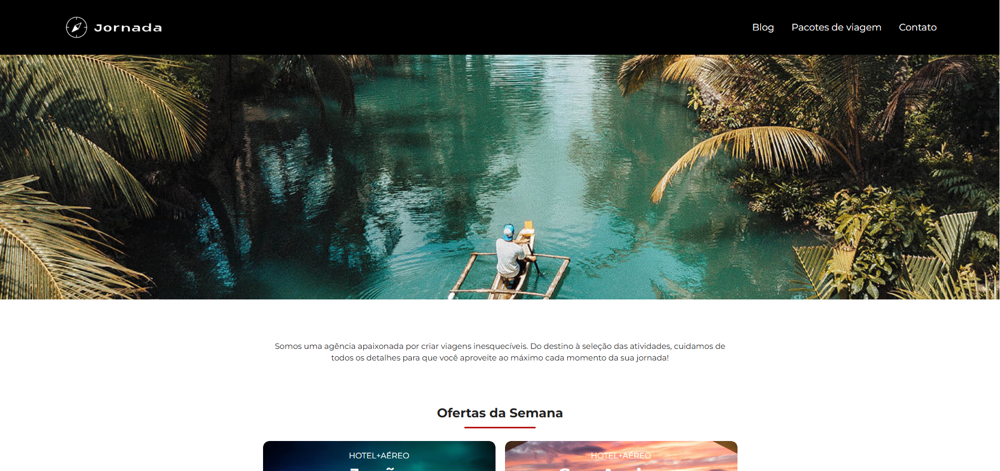
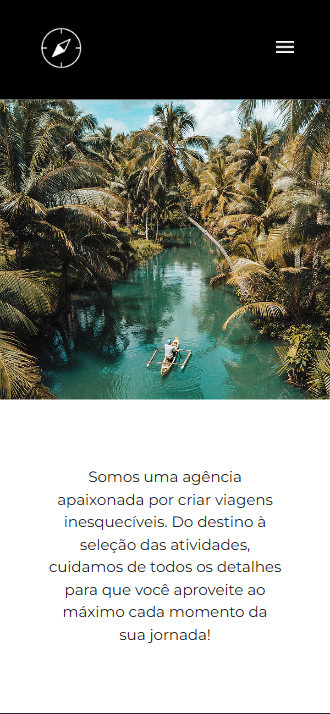
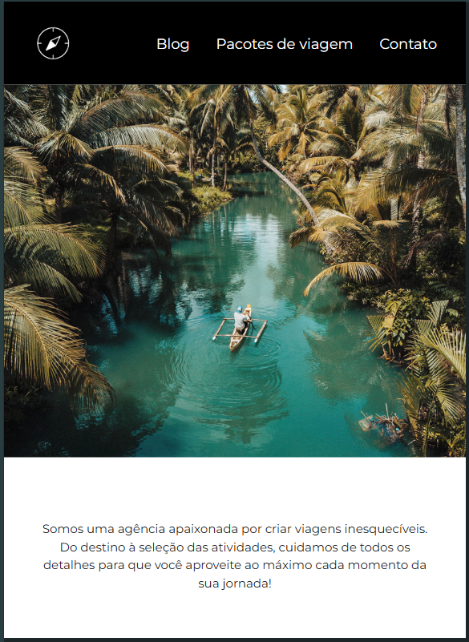

# ✈️ Jornada Viagens

Projeto de uma agência de viagens fictícia desenvolvido durante minha jornada de estudos em **Desenvolvimento Front-end**.

O projeto foi desenvolvido com foco em **responsividade, acessibilidade, estrutura semântica e organização do código**, utilizando HTML5 e CSS3.

---

## 📸 Preview

### 💻 Desktop



### 📱 Mobile



### 📲 Tablet



---

## 🚀 Acesse o projeto

🌐 **[Visualizar projeto](https://kaleo-a-m.github.io/jornada-viagens/)**

💻 **[Ver código no GitHub](https://github.com/kaleo-a-m/jornada-viagens)**

---

## 🛠️ Tecnologias

* **HTML5**
* **CSS3**
* **Flexbox**
* **CSS Grid**
* **Media Queries**
* **Figma**
* **Git**
* **GitHub**
* **GitHub Pages**

---

## 🎨 Design

O projeto foi inicialmente planejado através de um protótipo desenvolvido no **Figma**.

A partir do protótipo, a interface foi implementada utilizando HTML e CSS, buscando manter a estrutura visual e adaptar o layout para diferentes tamanhos de tela.

---

## 📱 Responsividade

O layout foi desenvolvido utilizando uma abordagem responsiva, permitindo que a página se adapte a diferentes dispositivos.

### 📱 Mobile

O layout é adaptado para telas menores, organizando os conteúdos de forma vertical e priorizando a experiência de navegação em dispositivos móveis.

### 📲 Tablet

Foram realizadas adaptações intermediárias para aproveitar melhor o espaço disponível em telas de tamanho médio.

### 💻 Desktop

Em telas maiores, os elementos são reorganizados para aproveitar melhor o espaço horizontal, proporcionando uma experiência mais confortável para o usuário.

Para isso, foram utilizados principalmente:

* Flexbox
* CSS Grid
* Media Queries
* Unidades relativas
* Breakpoints

---

## ♿ Acessibilidade

Durante o desenvolvimento, também foram consideradas boas práticas de acessibilidade.

Entre elas:

* Utilização de elementos semânticos do HTML5
* Uso adequado de elementos como `header`, `main`, `section`, `nav` e `footer`
* Textos alternativos (`alt`) para imagens
* Associação adequada entre labels e campos de formulário
* Uso de `aria-label` quando necessário
* Organização da estrutura pensando na navegação por tecnologias assistivas

---

## 📄 Páginas

- 🏠 **Página inicial** — apresentação da agência e destinos.
- ✈️ **Pacotes de viagens** — página com opções de viagens disponíveis.

## 📚 O que aprendi

O desenvolvimento do **Jornada Viagens** permitiu colocar em prática conceitos importantes do desenvolvimento Front-end.

### HTML

* Estrutura semântica
* Formulários
* Acessibilidade
* Organização do conteúdo

### CSS

* Flexbox
* CSS Grid
* Media Queries
* Responsividade
* Backgrounds e imagens
* Tipografia
* Espaçamento
* Organização de estilos

### Git e GitHub

* Criação de repositórios
* Commits
* Branches
* Push e Pull
* Versionamento do projeto
* Publicação utilizando GitHub Pages

---

## 📂 Estrutura do projeto

```text
jornada-viagens/
│
├── .vscode/
├── css/
├── fonts/
├── img/
├── favicon-branco.svg
├── favicon-bussola.png
├── index.html
└── pacotes-de-viagens.html

```
## 🎯 Objetivo do projeto

Este projeto faz parte da minha jornada de aprendizado e da construção do meu **portfólio como Desenvolvedor Front-end**.

Meu objetivo é continuar desenvolvendo projetos para aprimorar minhas habilidades, aplicar boas práticas e evoluir constantemente como desenvolvedor.

---

## 👨‍💻 Desenvolvedor

**Kaléo Maciel**

🔗 [GitHub](https://github.com/kaleo-a-m)

🌐 [Jornada Viagens](https://kaleo-a-m.github.io/jornada-viagens/)

---

⭐ Se você gostou do projeto, considere deixar uma estrela no repositório!
